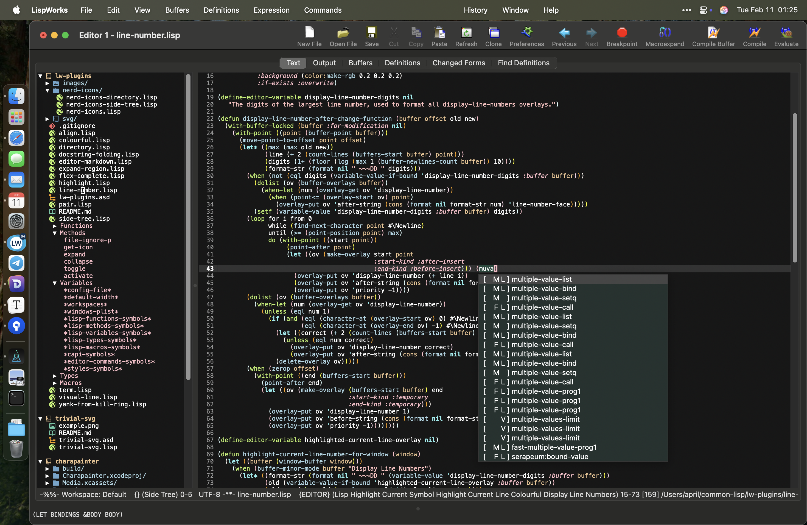

# LispWorks Plugins by April & May

Here's the LispWorks Plugins created by April & May. All plugins are zero-dependency (except sub-projects), tested under the LispWorks 8.0.1 Windows & Macintosh, safe for delivery, and have been used for a long time in my own. All the codes are licensed under [0BSD](https://spdx.org/licenses/0BSD.html)), allowing any kind of usage without any limitation. Feel free to include any part of them in your own product.

Here we provide:

- IDE Utilities
  - 🆕 [Display Line Numbers mode](#display-line-numbers-mode)
  - [Doc-string folding](#doc-string-folding)
  - [Enhanced Directory mode (Dired)](#enhanced-directory-mode)
  - [Enhanced Lisp syntax highlight](#enhanced-syntax-highlight)
  - [Expand Region](#expand-region)
  - 🆕 [Highlight current line](#highlight-current-line)
  - 🆕 [Highlight current symbol & Navigate between symbols](#highlight-current-symbol)
  - [In-place Fuzzy completion (like Sly)](#fuzzy-completion)
  - [Markdown syntax highlight](#markdown-syntax-highlight)
  - [Nerd Icons for Directory mode and Side Tree](#nerd-icons)
  - [Pair-Editing (electric-pair-mode)](#pair-editing)
  - [Side Tree (Treemacs)](#side-tree)
  - 🆕 [Visual Line Mode](#visual-line-mode)
  - 🆕 [Yank from kill-ring](#yank-from-kill-ring)
- Others
  - [Pure Lisp SVG renderer](./svg/)
  - [Unix PTY terminal & Ansi Escape Sequence support with Editor](#terminal-utilities)

The plugins are available via [Ultralisp](https://ultralisp.org)

```common-lisp
(ql:quickload :lw-plugins)
```

Or you can clone this repo to `~/common-lisp/` and

```common-lisp
(require "asdf")
(asdf:load-system :lw-plugins)
```



## Introductions

### Display Line Numbers mode

[Source](./line-number.lisp)

> Load the `lw-plugins` system, it will automatically turned-on.

Display line-numbers at the left side of Editor. Number at current line will be highlighted followed the move of cursor.

Commands:

- Display Line Numbers Mode (in EDITOR): Toggle the mode at current buffer.
- Global Display Line Numbers Mode (in EDITOR): Toggle the mode globally.

Customs:

- editor::line-number-face: The face of the number itself.
- editor::highlighted-line-number-face: The face of number when highlighted.

Implementation: Putting overlays on every #\Newlines in buffer. Numbers shown as `before-string` of the overlay.

---

### Doc-string Folding

[Source](./docstring-folding.lisp)

> Load the `lw-plugins` system. To automatically fold docstrings in Lisp buffers, put `(editor:add-global-hook editor:lisp-mode-hook 'editor::buffer-add-docstring-folding)` into your configuration.

Fold docstrings longer than 1 line by default. Folded docstring will be shown with "..." appended. Press `C-c C-d` to toggle the folding.

Commands:

- Fold Buffer Docstrings & Unfold Buffer Docstrings

Implementation: Putting overlays on exceeded docstrings with `EDITOR::INVISIBLE` `T`. Similar with the built-in Definition Folding facility.

---

### Enhanced Directory mode

[Source](./directory.lisp)

> Load the `lw-plugins` system, it will automatically turned-on.

Various enhancement to the built-in Directory Mode:

- Makes the key-bindings similar with Dired, with LW default bindings not changed
- Command for keys: ^, +, U, L, B, C, R, w, E, ~, #
- Support loading ASDF system
- Supporting Kill-when-Opening
- Supporting print file size in human-readable form
- Support delete directory tree & copy directory
- Complement for edge cases (like in commands C & R), Make them DWIM
- Bugfix

> To always keep only 1 Directory Mode buffer, put `(setf editor:*directory-mode-kill-when-opening-new-dired-buffer* t)` to your configuration.

---

### Enhanced syntax highlight

[Source](./colourful.lisp)

Provide elaborate syntax highlight to Lisp code. It is extremely helpful when there's lots of nested Sexps.

- Mark functions, macros, special-forms, dynamic variables, types and declarations in different colors
- Mark package of symbol before the colon

Faces under the COLOURFUL package:

- declaration-face
- builtin-face
  Apply to keywords
- type-face
  Apply to symbols start with #\&. e.g. `&key`, `&optional`.
- function-face
- macro-face
- special-operator-face
- variable-face

> Personally, I suggest using elaborate syntax highlight for Lisp language. That's because Lisp's S-exp is not symbolic enough to indicate its logical meaning, because all S-exps look same.
>
> For example, in C, function calls have operators at the head, conditional expressions have operators in the middle, and multiple sentences have braces enclosed. But in Lisp, they all look like a list of words inside a bracket.
>
> This makes syntax highlighting crucial - We have to highlight operators, keywords and brackets in different colors, or we can only see a bunch of white on our screen.

---

### Expand Region

[Source](./expand-region.lisp)

> Load the `lw-plugins` system. Press `C-=` to select current word, press again will expand the selection to current symbol, current Sexp, outer Sexp, and so on.

Similar with [expand-region.el](https://github.com/magnars/expand-region.el)

---

### Highlight current line

[Source](./highlight.lisp)

> Load the `lw-plugins` system, it will automatically turned-on.

Face: `editor::highlight-current-line-face`

Implementation: Put a face property between two `#\Newline` s.

---

### Highlight current symbol

[Source](./highlight.lisp)

> Load the `lw-plugins` system, it will automatically turned-on. Press `C-<` to navigate to previous occurence of the symbol, `C->` for next one.

All occurence of the symbol under current-point will be highlighted with background and underline.

Commands:

- Jump To Previous Same Symbol (default `C-<`)
- Jump To Next Same Symbol (default `C->`)

Face: `editor::highlight-current-symbol-face`

---

### Fuzzy completion

[Source](./flex-complete.lisp)

> Load the `lw-plugins` system, it will automatically turned-on.

Sly-style fuzzy-matching in-place code completion for LispWorks Editor.

Additionally, we support using `M-p` and `M-n` to select over completions, alternative to default Up / Down arrow key, since arrow keys are too far to reach for keyboards. This is implemented using `editor::pass-gesture-to-non-focus-completer`.

---

### Markdown syntax highlight

[Source](./editor-markdown.lisp)

> Load the `lw-plugins` system, the Markdown Mode will automatically turned-on for .md & .markdown files.

You can custom the appearance by modifying these symbols inside package `editor-markdown`:

- `*sans-serif-font-family-name*`
- `*monospace-font-family-name*`
- `*font-size*`
- `*header-font-size-increasement*`
- `md-*-face`

> This plugin needs evaluate (EDITOR-MARKDOWN:UPDATE-FACE) after CAPI initialized. Put the line in to your main function if you want to use it in delivered program.

Implemented by hand-written parser and customized Font Lock Mode.


---

### Nerd Icons

[Source](./nerd-icons/)

To use Nerd Icons, you should install [NerdFonts]("https://github.com/ryanoasis/nerd-fonts/releases/download/v3.2.1/NerdFontsSymbolsOnly.zip") first. You can do that by involking `Nerd Icons Install Font` Editor command if you have load [nerd-icons.lisp](./nerd-icons/nerd-icons.lisp).

> Note: If you choose to install other Nerd Fonts variant (not the Symbols Nerd Font), you should customize the `*nerd-font-family*` variable.

The Directory Mode integration is at [nerd-icons-directory.lisp](./nerd-icons/nerd-icons-directory.lisp), and the Side Tree integration is at [nerd-icons-side-tree.lisp](./nerd-icons/nerd-icons-side-tree.lisp).  They're all relying to [nerd-icons.lisp](./nerd-icons/nerd-icons.lisp). You can use the ASDF systems `lw-plugins/nerd-icons-directory` and `lw-plugins/nerd-icons-side-tree` to load them selectively.

For example, to load all features:

```common-lisp
(require "asdf")
(asdf:load-system :lw-plugins/nerd-icons-directory)
(asdf:load-system :lw-plugins/nerd-icons-side-tree)
```

The [nerd-icons.lisp](nerd-icons/nerd-icons.lisp) provides a most exausted icon selector for files and directories, created in myself. Use `nerd-icons:file-to-icon-char` to get the corresponding character of a file or directory, or use `nerd-icons:file-to-icon-name` to get a symbol naming with the name of the icon. The corresponding character and character code are storage inside its symbol-plist with `:code` and `:char` properties.

---

### Pair-Editing

[Source](./pair.lisp)

> Load the `lw-plugins` system, it will automatically turned-on.

Like `electric-pair-mode` in Emacs. Auto-insert or delete right pair of paired characters when inserting / deleting the left one.

Defining `editor::*pairs*` variables before loading the system to customize which pairs of characters should be auto-inserted and deleted. Default pairs are `()`, `[]`, `{}`, `""` and `||`.

---

### Side Tree

[Source](./side-tree.lisp)

> Load the `lw-plugins` system, Press `M-0` at an Editor IDE tool window to open Side Tree, and switch between Side Tree and normal buffer.

[Treemacs](https://github.com/Alexander-Miller/treemacs) in LispWorks. Support workspaces, projects and tags for Lisp files.

Key-bindings are same with Treemacs. See the end of the source code for details.

Additionally, Side Tree support most key-bindings of Dired. Press `C`, `R`, `L`, `E`, etc. will invoke corresponding action

Press #\Tab on a Lisp file will show a list of functions, variables, methods defined in the file. Press #\Enter will navigate to its definition.

---

### Visual Line Mode

[Source](./side-tree.lisp)

> Load the `lw-plugins` system, invoke "Visual Line Mode" command when needed.

Useful for working in Editor with Serif fonts, or has long truncated lines.

Similar with `visual-line-mode` in Emacs. With the mode turned on, the default cursor moving functions will be replaced to Visual version, which will move the cursor by its pixel position instead of logical place.

It may be useful for those who want to ship applications that using Serif font in Editor.

---

### Yank from kill-ring

[Source](./yank-from-kill-ring.lisp)

> Load the `lw-plugins` system, Press `M-y` to trigger the pop-up.

Since Emacs 28, Press `M-y` without `C-y` before will pop-up a buffer with the kill-ring contents, allow users to select previous killed text. This plugin implements this function in LW Editor.

---

### Terminal Utilities

[Source](term.lisp)

> Copy its source code if you want to use it in your own product.

It contains:

1. A stream connected to an Editor buffer, called ESCAPED-EDITOR-STREAM, which support XTerm-style ANSI escape sequences
2. A real PTY stream called PTY-STREAM, which will open a pseudo-tty process on Unix and connects to it;
3. A sample CAPI:EDITOR subclass called PTY-PANE, which combines these two features and an input handling system into a working terminal

The example terminal (lw-term::pty-pane) support running NeoVim and Emacs inside with plugins installed.

Can be useful when you want to show your users colorful terminal output & run a external TUI program.

Motivation:

> And about the terminal, It’s actually a deviation of my own product: I want to show my users the output of a terminal program, but that output is COLOURFUL… So I have to implement an "ANSI escape sequence => LW Editor text property” converter myself...
>
> Then, after I finished, I need to give a full test to the converter. That sounds easy, right? just send it strings from SYS:RUN-SHELL-COMMAND running some TUI program… Boom! The TUI program shuts down because it tells me the SYS::PTY-STREAM is not a Pseudo-TTY… In fact, It’s a pseudo-pseudo-tty that’s not created with `forkpty()` from Unix libc… What can I say! 
>
> Thanks the LW FLI, writing a C bridge to `forkpty` is not difficult, so again, I implemented it myself… After testing, I found that I’ve almost finished a whole project “accidentally”. Hopefully you can have a reliable library now to show colorful terminal output to your customers, my friends!
>
> Hopelessly
> April

----------------

## Acknowledgements

Thanks to the LispWorks Ltd. to provide us the exellent product.

Thanks sister Simone, and my headmate May, who help and support me.

Supporting Neurodiversity & Transgender & Plurality!

🏳️‍🌈🏳️‍⚧️
