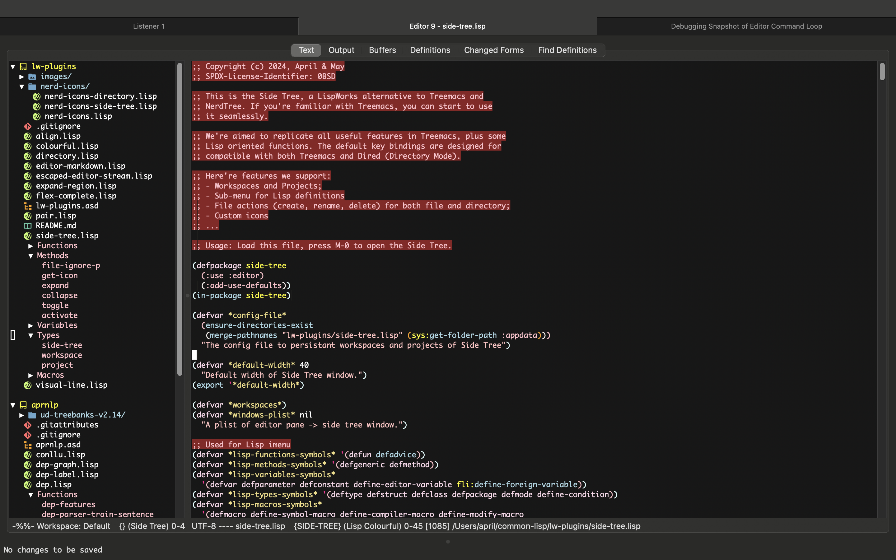
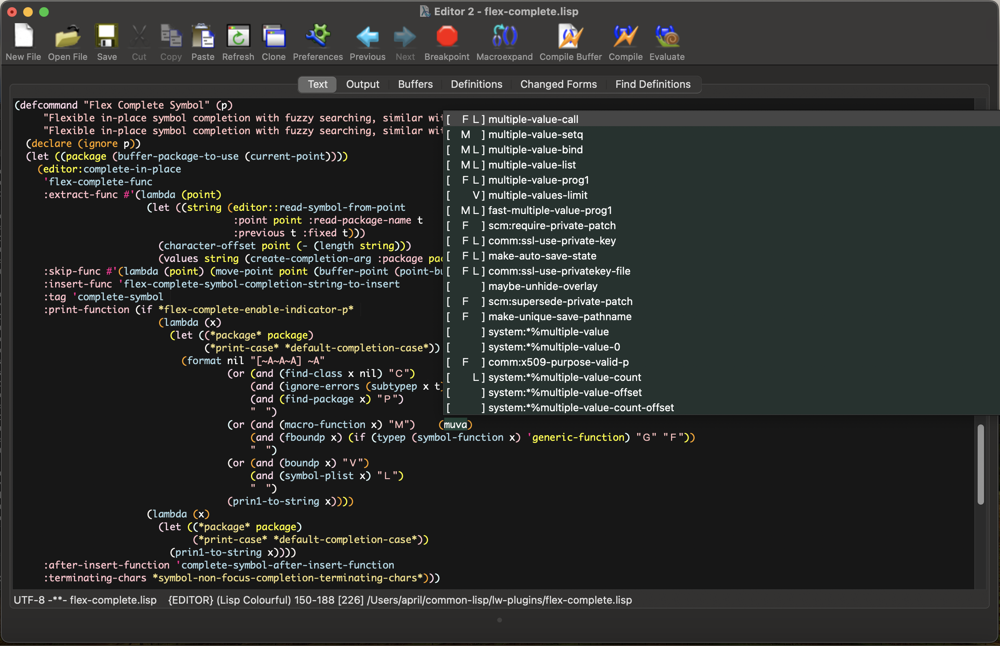

# LispWorks Plugins by April & May

Here's the LispWorks Plugins created by April & May. All plugins are
zero-dependency, tested under the LispWorks 8.0.1 Windows & Macintosh,
safe for delivery, and have been used for a long time in my own. All
the codes are licensed under
[0BSD](https://spdx.org/licenses/0BSD.html)), allowing any kind of
usage without any limitation. Feel free to include any part of them in
your own product.

Here we provide:

- [NEW] A docstring folding facility, similar with definition folding([docstring-folding.lisp](./docstring-folding.lisp))
- [NEW] Side Tree, a project explorer alternative to [Treemacs](https://github.com/Alexander-Miller/treemacs) ([side-tree.lisp](./side-tree.lisp))
- [NEW] The [Nerd Fonts](https://www.nerdfonts.com) integration for LispWorks Editor, Giving colourful icons to Directory Mode and Side Tree ([nerd-icons/](./nerd-icons/))
- A Sly-style flexible fuzzy-matching in-place code completion for LispWorks Editor ([flex-complete.lisp](./flex-complete.lisp))
- A decent syntax highlight method of Markdown for LispWorks Editor ([editor-markdown.lisp](./editor-markdown.lisp))
- A decent & elaborate syntax highlight method of Lisp for LispWorks Editor ([colourful.lisp](./colourful.lisp))
- An output stream that support ANSI escape sequences and format the output into Editor buffer ([escaped-editor-stream.lisp](./escaped-editor-stream.lisp))
- A enhancing / bugfixing / edge-case completing plugin for LispWorks Directory Mode, make it more similar with Emacs's dired ([directory.lisp](./directory.lisp))
- An expand-region plugin for Lisp editing in LispWorks Editor, similar with [expand-region.el](https://github.com/magnars/expand-region.el) ([expand-region.lisp](./expand-region.lisp))
- A Lisp form aligning facility ([align.lisp](./align.lisp))
- A simple pair-editing facility like Emacs's electric-pair-mode, with just enough of functions ([pair.lisp](./pair.lisp))

## Usage

Basically, just simply load any file you want to include. Some plugins
has specific requirement for delivery (like
[editor-markdown](editor-markdown.lisp)). For details, please visit
each source file and read the top comment lines of them.

Here's a sample code to load all of them into your LispWorks IDE. We
assume that you clone this repo into `~/common-lisp/lw-plugins`:

	(dolist (file (directory #P"~/common-lisp/lw-plugins/*.lisp"))
	  (compile-file file :load t))

There's also an ASDF system file. You can load it using ASDF:

	(require "asdf")
	(asdf:load-system :lw-plugins)

### Nerd Icons

To use Nerd Icons, you should install
[NerdFonts]("https://github.com/ryanoasis/nerd-fonts/releases/download/v3.2.1/NerdFontsSymbolsOnly.zip")
 first. You can do that by involking `Nerd Icons Install Font` if you
have load [nerd-icons.lisp](./nerd-icons/nerd-icons.lisp).

> Note: If you choose to install other Nerd Fonts variant (not the Symbols Nerd Font), you should customize the `*nerd-font-family*` variable.

The Directory Mode integration is at
[nerd-icons-directory.lisp](./nerd-icons/nerd-icons-directory.lisp),
 and the Side Tree integration is at
[nerd-icons-side-tree.lisp](./nerd-icons/nerd-icons-side-tree.lisp).
They're all relying to
[nerd-icons.lisp](./nerd-icons/nerd-icons.lisp). You can use the ASDF
systems `lw-plugins/nerd-icons-directory` and
`lw-plugins/nerd-icons-side-tree` to load them selectively.

For example, to load all features:

```common-lisp
(require "asdf")
(asdf:load-system :lw-plugins)
(asdf:load-system :lw-plugins/nerd-icons-directory)
(asdf:load-system :lw-plugins/nerd-icons-side-tree)
```

----------------

## Acknowledgements

Thanks to the LispWorks Ltd. to provide us the exellent product.

Thanks my headmate, May, who helps and supports me.

Supporting Neurodiversity & Transgender & Plurality!

🏳️‍🌈🏳️‍⚧️

----------------

## Screenshots

### Side Tree (with Nerd icons)



### Flex completion & Colourful highlight



### Markdown


