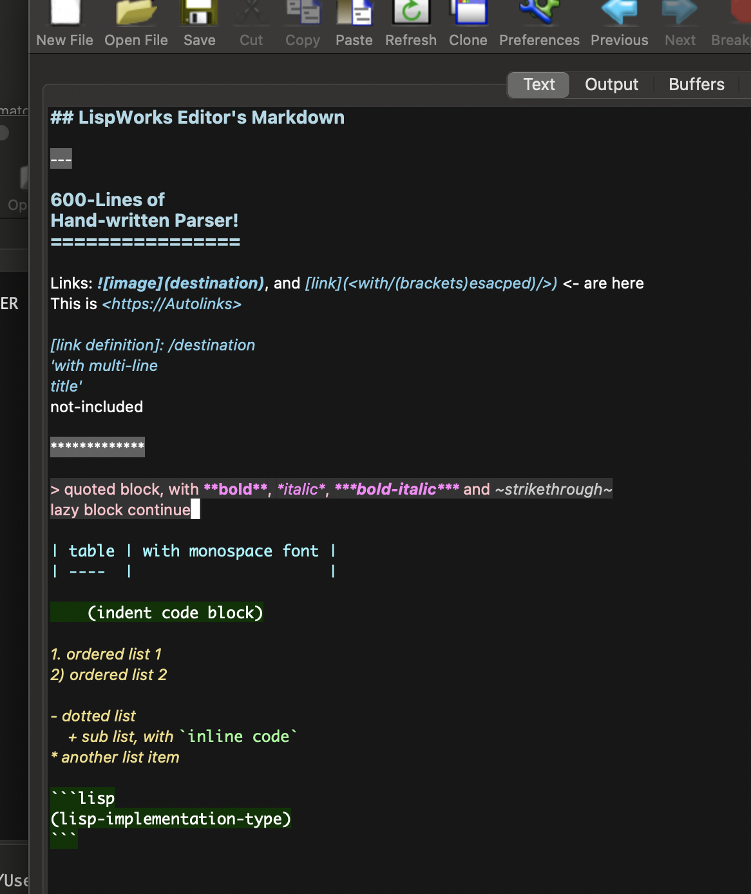

## LispWorks Plugins by April & May

Here's the LispWorks Plugins created by April & May. All plugins are
tested under the LispWorks 8.0.1 Windows & Macintosh, safe for
delivery, and have been used for a long time in my own. All the codes
are licensed under [0BSD](https://spdx.org/licenses/0BSD.html)),
allowing any kind of usage without any limitation. Feel free to
include any part of them in your own product.

Here we provide:

- A decent & elaborate syntax highlight method of Lisp for LispWorks Editor ([colourful.lisp](./colourful.lisp))
- A decent syntax highlight method of Markdown for LispWorks Editor ([editor-markdown.lisp](./editor-markdown.lisp))
- A Sly-style flexible fuzzy-matching in-place code completion for LispWorks Editor ([flex-complete.lisp](./editor-markdown.lisp))
- A enhancing / bugfixing / edge-case completing plugin for LispWorks Directory Mode, make it more similar with Emacs's dired ([directory.lisp](./directory.lisp))
- A expand-region plugin for Lisp editing in LispWorks Editor, similar with [expand-region.el](https://github.com/magnars/expand-region.el) ([expand-region.lisp](./expand-region.lisp))
- A simple pair-editing facility like Emacs's electric-pair-mode, with just enough of functions ([pair.lisp](./pair.lisp))

### Screenshots

#### Flex completion

#### Markdown

------------------

Supporting Neurodiversity & Transgender & Plurality!

🏳️‍🌈🏳️‍⚧️
