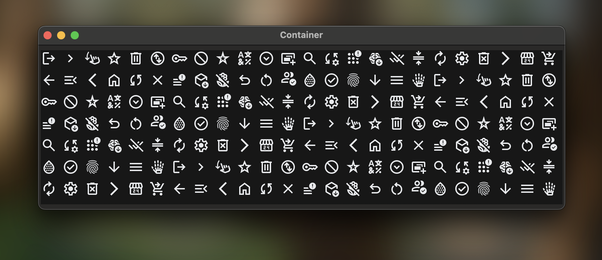

# LispWorks SVG Support

This plugin allows you to render SVG images with LispWorks using the Graphics Port utility.

The library is purely written in Common Lisp with no foreign dependency. It's heavily optimized for fast parsing and rendering. 0BSD licensed.



> There're 168 Google Material Symbol SVGs above. It's almost instant for parsing & rendering all of them, nether stuck nor flicker when resizing & redisplaying. LispWorks 8.0.1 on Apple M3 chip, renderer not cached.

## Package & Dependencies

We provide 2 ASDF systems: `lw-svg` , and `lw-svg-test` for testing. They depend on:

- alexandria
- cl-ppcre
- plump
- serapeum

## Usage

### Simple method: `draw-svg-from-string`:

``` common-lisp
(defparameter *test-svg-string*
  "<svg xmlns='http://www.w3.org/2000/svg'
        height='24px' viewBox='0 -960 960 960' width='24px' fill='#888888'>
     <path d='m321-80-71-71 329-329-329-329 71-71 400 400L321-80Z'/>
   </svg>")

(capi:contain
 (make-instance
  'capi:output-pane
  :display-callback
  (lambda (port x y w h)
    (draw-svg-from-string port *test-svg-string* 0 0))))
```

You are supposed to see a gray right-chevron at the left-top of the `output-pane`.

### Cache renderer for faster redisplay

*Function* **create-renderer** *port* *node* *`&optional`* *(root-node node) (container-attributes (make-hash-table :test #'equalp))* => *function*

The funcion `create-renderer` accepts a `plump:node` *node,* which should be a valid SVG element, and will parse it into a "renderer function". The `port` should be a graphics port that is only used to query graphic information like geometry, font size and so on. `root-node` refers to the DOM root of the SVG element, it's used to search referenced elements by ID; `container-attributes` is used to store inherited attributes in recursive parsing.

The result function accepts 1 argument: The graphics port you want to draw the SVG with. Each time when the function is called, the function will execute a series of GP drawing functions to draw the SVG on the port at predefined location. You can use functions like `gp:with-graphics-transform` to change the drawing result.

You can create a renderer function at the first time you draw an SVG, or before your drawing with a hidden graphics port, and cache it for redisplaying. When the redisplay is triggered, but the content of the SVG doesn't need to change, you can just call the cached function. This will draw the SVG much faster without parsing the DOM & constructing the rendering tree again.

See the source code of `draw-svg-from-string` for example.

> There're also some CSS parser inside the code. Take them if they're useful for you.

## Development

The plugin has not fully covered the SVG specification yet. It may misbehave when dealing with elements that are unsupported or complexly cascaded. Here's a list that it can deal with, emphasized means only partly implemented:

- Elements
  - circle
  - defs
  - ellipse
  - g
  - image
  - line
  - *linearGradient*
  - path
  - polygon
  - polyline
  - *radialGradient*
  - rect
  - stop
  - svg
  - *text*
  - *tspan*
  - use
- presentation attributes
  - color
  - fill
  - fill-opacity
  - fill-rule
  - opacity
  - stop-color
  - stop-opacity
  - stroke
  - stroke-dasharray
  - stroke-linecap
  - stroke-linejoin
  - stroke-opacity
  - stroke-width
  - transform

Here's what we're planning to do now:

- [x] Support specifying attributes with inline `style` attribute and CSS `style` element
- [ ] Support `text` and `tspan`
  - [x] `x`, `y`, `dx`, `dy`, `rotate`
  - [ ] SVG2 Content area & SVG tiny `textArea`
  - [ ] ...
  
- [ ] Support `image`, `marker` and `symbol` (and maybe `a`?)
- [ ] Support gradients `spreadMethod` and `pattern`
- [ ] Support clipping and masking
- [ ] Formal error handling

### Testing

At the end of the [lw-svg.lisp](./lw-svg.lisp) there's an "interactive test", it will load a same SVG side-by-side, one using the `capi:browser-pane`, another using the `capi:output-pane` with `lw-svg` library. It allows us to compare and check if the two images are identical on the screen. Images used for test are example images shown on W3C's SVG specification. You need LispWorks for Macintosh to run the interactive test, as `capi:browser-pane` does not support other Unix, and on Windows it is too old to use.

---

## Acknowledgements

Thanks to the LispWorks Ltd. to provide us the exellent product.

Thanks my sister Simone, and my headmate May, who help and support me.

Supporting Neurodiversity & Transgender & Plurality!

🏳️‍🌈🏳️‍⚧️